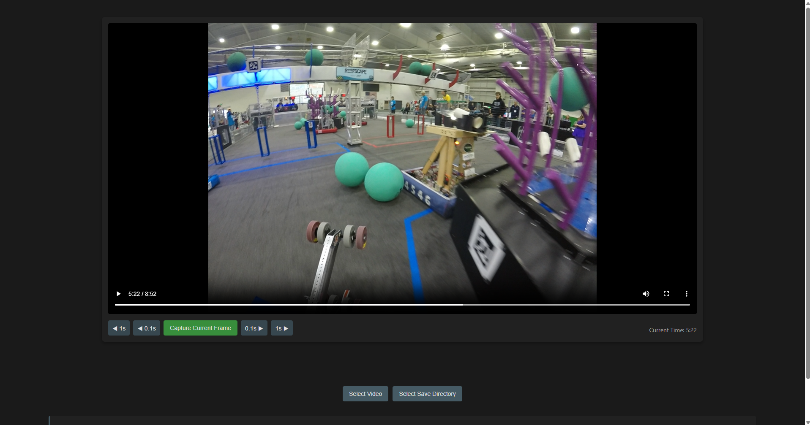
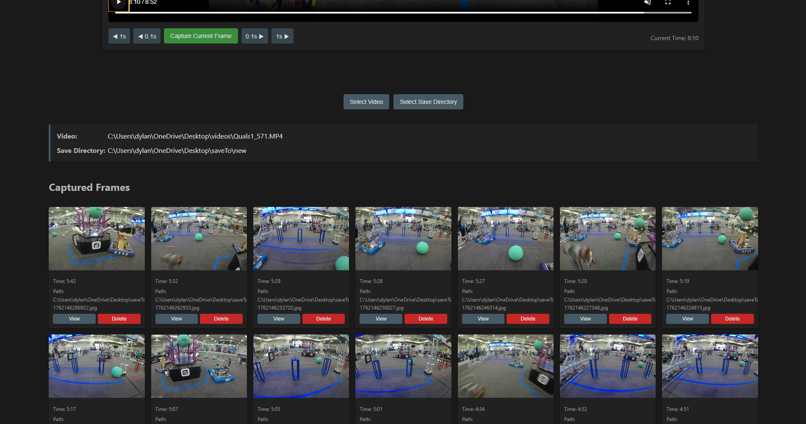
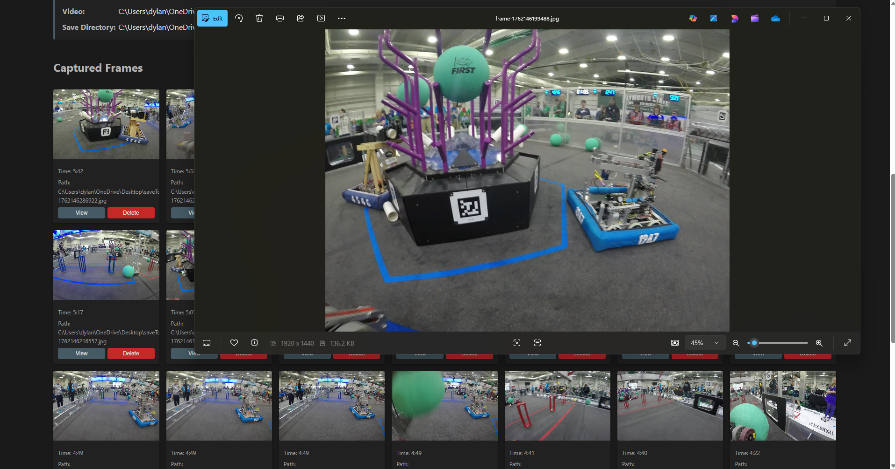

# VideoDatasetTool

Extract high-quality frames from videos with a simple, fast desktop UI.


## Table of Contents
- [Overview](#overview)
- [Usage & Demo](#usage--demo)
- [Quick Start](#quick-start)
- [Configuration](#configuration)
- [Project Layout](#project-layout)
- [Roadmap](#roadmap)
- [Contributing](#contributing)
- [Troubleshooting / FAQ](#troubleshooting--faq)
- [References](#references)

## Overview
- Cross-platform Electron desktop app for building image datasets from videos.
- Navigate precisely (±0.1s, ±1s), preview, and capture current frame to `jpg`.
- Save outputs to a chosen directory, quickly view or delete captured frames.
- Ships with `ffmpeg` via `ffmpeg-static` for reliable, zero-install frame extraction.
- Packaged installers for Windows (NSIS). Mac and Linux builds supported in scripts.

Primary use cases
- Dataset creation for CV/ML (classification, detection, tracking).
- Thumbnail generation and storyboard creation.
- Frame-by-frame analysis and annotation workflows.

Target users
- ML researchers, data engineers, and computer vision practitioners.
- Video editors needing precise frame snapshots.
- Developers wanting a simple GUI on top of `ffmpeg`.

Tech & scope
- Type: Desktop App (Electron).
- Languages: JavaScript, HTML, CSS.
- Frameworks/Dependencies: `electron`, `electron-builder`, `fluent-ffmpeg`, `ffmpeg-static`.
- Runtime: Node.js + Chromium via Electron.
- Build/Packaging: `electron-builder` for Windows/Mac/Linux.

## Usage & Demo
Desktop app
- Click `Select Video` to load a file (`mp4, avi, mov, mkv, webm`).
- Optionally `Select Save Directory`; otherwise defaults to Pictures (`app.getPath('pictures')`).
- Navigate precisely using the ±0.1s and ±1s controls; pause ensures exact positioning.
- Click `Capture Current Frame` to save a `jpg` of the current frame.
- Use `View` to open the image with the OS default app; `Delete` removes it.

Screenshots







## Quick Start
- Prerequisites: `Node.js >= 18`, `npm`, Windows/macOS/Linux.
- Install dependencies: `npm install`
- Start in development: `npm start`
- Build installers:
  - Windows (NSIS): `npm run build`
  - macOS: `npm run build-mac` (requires `build/icon.icns`)
  - Linux (AppImage): `npm run build-linux`

Outputs
- Windows builds and unpacked app in `dist/` (e.g., `dist/VideoDatasetTool Setup 1.0.0.exe`).

## Configuration
Defaults and options

| Setting | Source | Default | Notes |
|--------|--------|---------|-------|
| Video file filters | `main.js` | `mp4, avi, mov, mkv, webm` | Open dialog filter. |
| Save directory | `main.js` | `app.getPath("pictures")` | Used if none selected. |
| Output filename | `renderer.js` | `frame-<timestamp>.jpg` | Timestamp-based unique names. |
| Output size | `main.js` | `100%` | Original resolution. |
| ffmpeg path | `main.js` | `ffmpeg-static` | Uses asar-unpacked when packaged. |

Optional environment variables (advanced)
- `FFMPEG_PATH`, `FFPROBE_PATH`: If you modify integration to rely on env vars, these can override binary paths used by `fluent-ffmpeg`.

## Project Layout
```
VideoDatasetTool/
├── index.html           # UI markup (video player, controls, info blocks)
├── styles.css           # Dark-themed responsive styling
├── renderer.js          # UI logic, IPC invokes, frame list management
├── main.js              # Electron main process, dialogs, ffmpeg extraction
├── package.json         # App metadata, scripts, builder config, deps
├── build/               # App icons for packaging (win/mac/linux)
├── dist/                # Build outputs (NSIS installer, unpacked app)
└── README.md            # This document
```

## Roadmap
- Keyboard shortcuts for navigation and capture.
- Batch capture at intervals (e.g., every N frames/seconds).
- Configurable output formats (PNG/WebP) and quality settings.
- Metadata export (CSV/JSON) including timestamps and file paths.
- Multi-video queue and progress tracking.
- CI builds for Windows/macOS/Linux with code signing support.
- Optional annotation overlays and bookmarking.

## Contributing
- Fork and branch from `main` (`feat/*`, `fix/*`).
- Use Conventional Commits (e.g., `feat: add interval capture`).
- Run locally with `npm install && npm start`.
- Ensure PRs pass build/lint checks if/when CI is added.
- Prefer small, focused PRs with screenshots for UI changes.

## Troubleshooting / FAQ
- “ffmpeg not found” during development
  - Ensure `node_modules/ffmpeg-static` installed; run `npm install` again.
  - Delete `node_modules` and lockfile, reinstall.
- macOS build fails with icon error
  - Provide `build/icon.icns` or update `package.json` to point to a valid icon.
- Captures appear blank or off by a frame
  - Try pausing playback before capture; some codecs require keyframe alignment for consistent thumbnails.
- Antivirus blocks installer or app
  - Code signing and distributing via trusted channels helps; for local dev, whitelist the app.
- Permissions errors when saving
  - Choose a writable directory; default Pictures path avoids elevated permission requirements.

## References
- Electron official README and docs for platform support and patterns [1][2].
- Electron sample apps for README and app structuring inspiration [3][4][5].
- `fluent-ffmpeg` documentation for usage conventions and binary path notes [6][7][8].

References:
- [1] https://github.com/electron/electron/blob/main/README.md
- [2] https://www.electronjs.org/docs/latest
- [3] https://github.com/electron/simple-samples
- [4] https://github.com/hokein/electron-sample-apps
- [5] https://github.com/electron/apps
- [6] https://github.com/fluent-ffmpeg/node-fluent-ffmpeg
- [7] https://github.com/fluent-ffmpeg/node-fluent-ffmpeg/blob/master/README.md
- [8] https://www.npmjs.com/package/fluent-ffmpeg